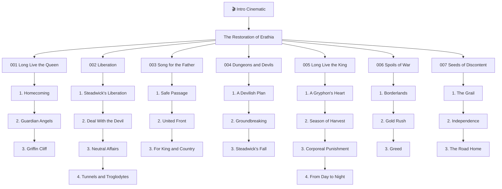
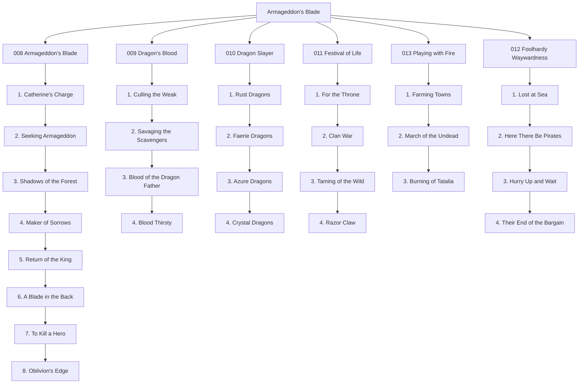
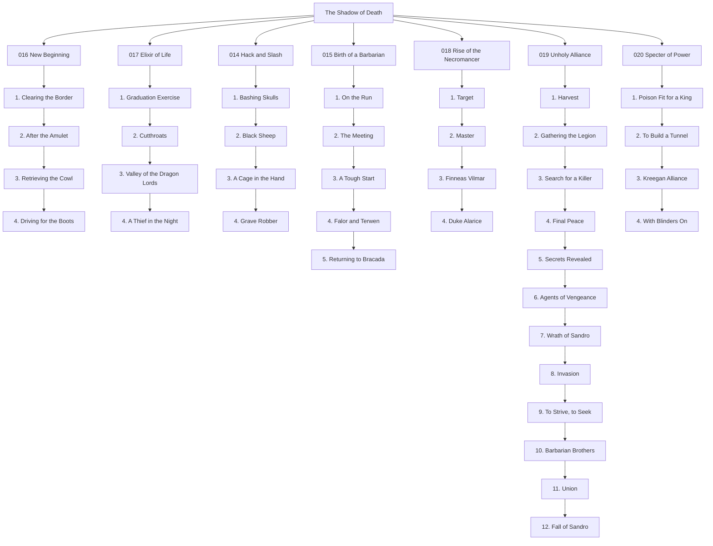

# Heroes of Might and Magic III: Complete (GOG) — Chronological Content Map

## The Restoration of Erathia

```mermaid
graph TD
Intro[🎬 Intro Cinematic] --> Erathia[The Restoration of Erathia]

Erathia --> C001[001 Long Live the Queen]
C001 --> C001M1[1. Homecoming]
C001M1 --> C001M2[2. Guardian Angels]
C001M2 --> C001M3[3. Griffin Cliff]

Erathia --> C002[002 Liberation]
C002 --> C002M1[1. Steadwick's Liberation]
C002M1 --> C002M2[2. Deal With the Devil]
C002M2 --> C002M3[3. Neutral Affairs]
C002M3 --> C002M4[4. Tunnels and Troglodytes]

Erathia --> C003[003 Song for the Father]
C003 --> C003M1[1. Safe Passage]
C003M1 --> C003M2[2. United Front]
C003M2 --> C003M3[3. For King and Country]

Erathia --> C004[004 Dungeons and Devils]
C004 --> C004M1[1. A Devilish Plan]
C004M1 --> C004M2[2. Groundbreaking]
C004M2 --> C004M3[3. Steadwick's Fall]

Erathia --> C005[005 Long Live the King]
C005 --> C005M1[1. A Gryphon's Heart]
C005M1 --> C005M2[2. Season of Harvest]
C005M2 --> C005M3[3. Corporeal Punishment]
C005M3 --> C005M4[4. From Day to Night]

Erathia --> C006[006 Spoils of War]
C006 --> C006M1[1. Borderlands]
C006M1 --> C006M2[2. Gold Rush]
C006M2 --> C006M3[3. Greed]

Erathia --> C007[007 Seeds of Discontent]
C007 --> C007M1[1. The Grail]
C007M1 --> C007M2[2. Independence]
C007M2 --> C007M3[3. The Road Home]
```

## Armageddon's Blade

```mermaid
graph TD
AB[Armageddon's Blade] --> C008[008 Armageddon's Blade]
C008 --> C008M1[1. Catherine's Charge]
C008M1 --> C008M2[2. Seeking Armageddon]
C008M2 --> C008M3[3. Shadows of the Forest]
C008M3 --> C008M4[4. Maker of Sorrows]
C008M4 --> C008M5[5. Return of the King]
C008M5 --> C008M6[6. A Blade in the Back]
C008M6 --> C008M7[7. To Kill a Hero]
C008M7 --> C008M8[8. Oblivion's Edge]

AB --> C009[009 Dragon's Blood]
C009 --> C009M1[1. Culling the Weak]
C009M1 --> C009M2[2. Savaging the Scavengers]
C009M2 --> C009M3[3. Blood of the Dragon Father]
C009M3 --> C009M4[4. Blood Thirsty]

AB --> C010[010 Dragon Slayer]
C010 --> C010M1[1. Rust Dragons]
C010M1 --> C010M2[2. Faerie Dragons]
C010M2 --> C010M3[3. Azure Dragons]
C010M3 --> C010M4[4. Crystal Dragons]

AB --> C011[011 Festival of Life]
C011 --> C011M1[1. For the Throne]
C011M1 --> C011M2[2. Clan War]
C011M2 --> C011M3[3. Taming of the Wild]
C011M3 --> C011M4[4. Razor Claw]

AB --> C013[013 Playing with Fire]
C013 --> C013M1[1. Farming Towns]
C013M1 --> C013M2[2. March of the Undead]
C013M2 --> C013M3[3. Burning of Tatalia]

AB --> C012[012 Foolhardy Waywardness]
C012 --> C012M1[1. Lost at Sea]
C012M1 --> C012M2[2. Here There Be Pirates]
C012M2 --> C012M3[3. Hurry Up and Wait]
C012M3 --> C012M4[4. Their End of the Bargain]
```

## The Shadow of Death

```mermaid
graph TD
SoD[The Shadow of Death] --> C016[016 New Beginning]
C016 --> C016M1[1. Clearing the Border]
C016M1 --> C016M2[2. After the Amulet]
C016M2 --> C016M3[3. Retrieving the Cowl]
C016M3 --> C016M4[4. Driving for the Boots]

SoD --> C017[017 Elixir of Life]
C017 --> C017M1[1. Graduation Exercise]
C017M1 --> C017M2[2. Cutthroats]
C017M2 --> C017M3[3. Valley of the Dragon Lords]
C017M3 --> C017M4[4. A Thief in the Night]

SoD --> C014[014 Hack and Slash]
C014 --> C014M1[1. Bashing Skulls]
C014M1 --> C014M2[2. Black Sheep]
C014M2 --> C014M3[3. A Cage in the Hand]
C014M3 --> C014M4[4. Grave Robber]

SoD --> C015[015 Birth of a Barbarian]
C015 --> C015M1[1. On the Run]
C015M1 --> C015M2[2. The Meeting]
C015M2 --> C015M3[3. A Tough Start]
C015M3 --> C015M4[4. Falor and Terwen]
C015M4 --> C015M5[5. Returning to Bracada]

SoD --> C018[018 Rise of the Necromancer]
C018 --> C018M1[1. Target]
C018M1 --> C018M2[2. Master]
C018M2 --> C018M3[3. Finneas Vilmar]
C018M3 --> C018M4[4. Duke Alarice]

SoD --> C019[019 Unholy Alliance]
C019 --> C019M1[1. Harvest]
C019M1 --> C019M2[2. Gathering the Legion]
C019M2 --> C019M3[3. Search for a Killer]
C019M3 --> C019M4[4. Final Peace]
C019M4 --> C019M5[5. Secrets Revealed]
C019M5 --> C019M6[6. Agents of Vengeance]
C019M6 --> C019M7[7. Wrath of Sandro]
C019M7 --> C019M8[8. Invasion]
C019M8 --> C019M9[9. To Strive, to Seek]
C019M9 --> C019M10[10. Barbarian Brothers]
C019M10 --> C019M11[11. Union]
C019M11 --> C019M12[12. Fall of Sandro]

SoD --> C020[020 Specter of Power]
C020 --> C020M1[1. Poison Fit for a King]
C020M1 --> C020M2[2. To Build a Tunnel]
C020M2 --> C020M3[3. Kreegan Alliance]
C020M3 --> C020M4[4. With Blinders On]
```
