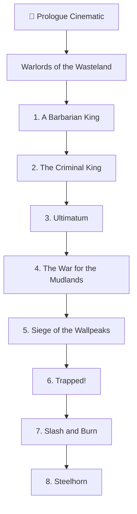
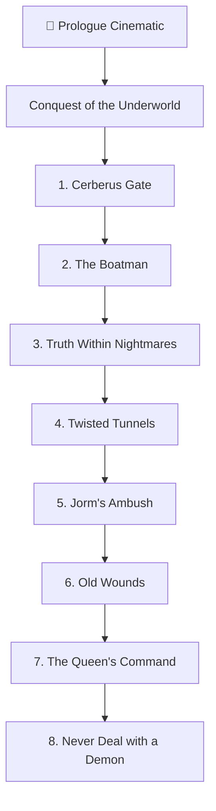
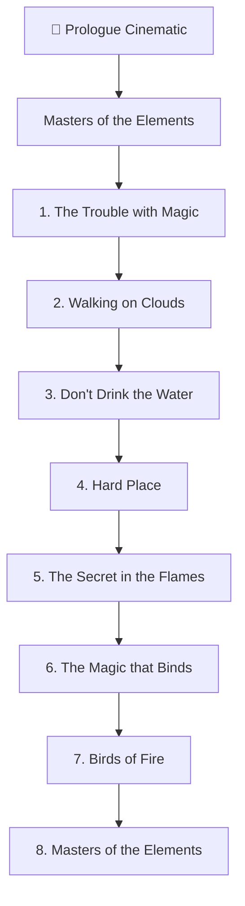
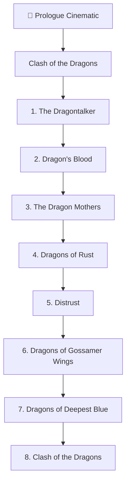
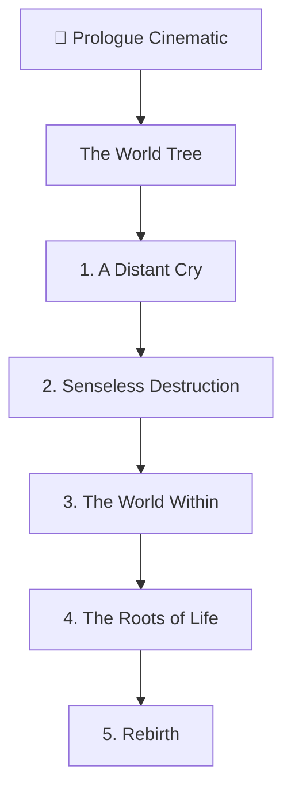
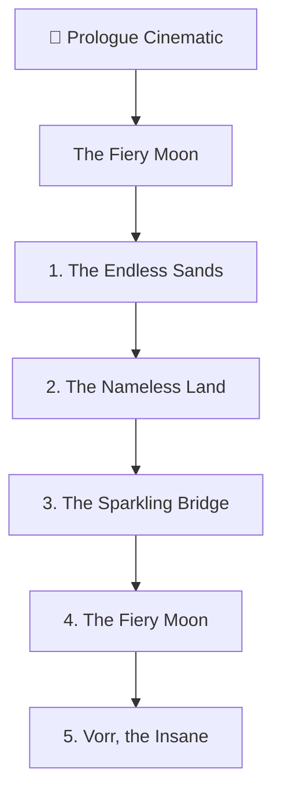
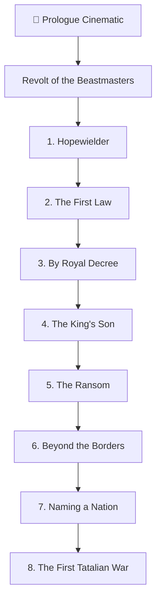
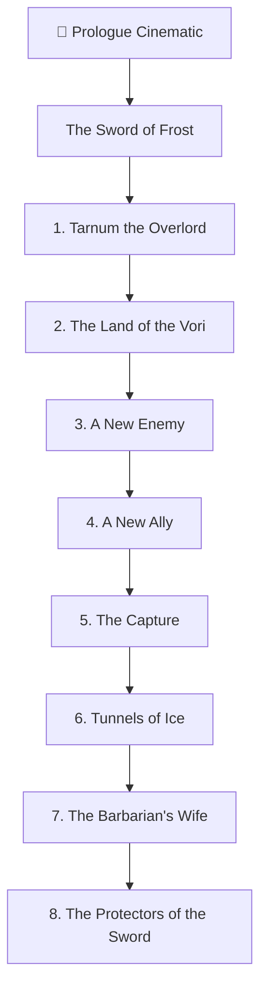

# Heroes Chronicles — Content Map

Each of the 8 episodes opens with its own **Prologue** video (that's the wiki's own term for
what the main game calls "Intro Cinematic") — narrated by **The Historian** in every single
episode, not a per-episode character. Individual maps inside an episode have no separately
narrated intro documented on the wiki (unlike RoE/AB/SoD missions).

## 1 — Warlords of the Wasteland

## 2 — Conquest of the Underworld

## 3 — Masters of the Elements

## 4 — Clash of the Dragons

## 5 — The World Tree

## 6 — The Fiery Moon

## 7 — Revolt of the Beastmasters

## 8 — The Sword of Frost

